# I - Part I (Hidden) {visibility="hidden"}


## Background - computational mechanics

{height="100%" fig-align="center"}


## Polytechnique Institut of Paris

* 6 engineering schools
  * Mechanics, (applied) math, physics, economics, statistics, computer science, optics, quatum physics, etc. 
* 7000 students
* 1131 (Assistant) professors

:::: {.columns}

::: {.column width="60%"}

{width=90% fig-align="center"}

:::

::: {.column width="40%"}

:::: {style='margin-top: 6em;'}
::::

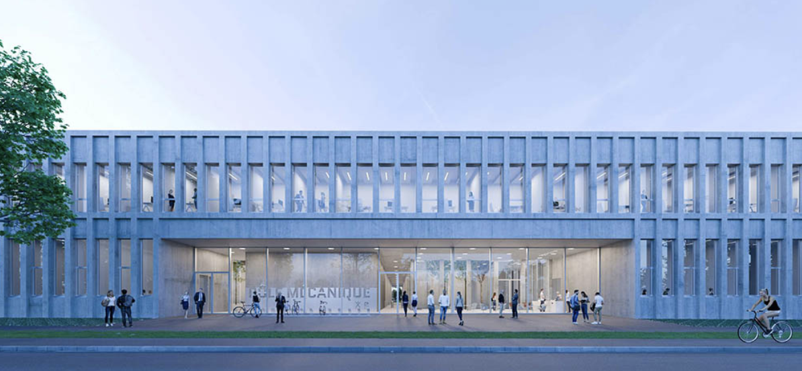{width=100% fig-align="center"}

:::

::::


## Idiopathic Pulmonary Fibrosis

:::: {.columns}

::: {.column width="50%"}

{ height="300" loop="true" autoplay=true}

:::

::: {.column width="50%"}

{ height="300" loop="true" autoplay=true}

:::

::::


:::: {.columns}

::: {.column width="50%"}

:::: {.mybox}

::: {.mybox-header}
Objectives
:::

::: {.mybox-body}
* Improved understanding of the **mechanically-driven** physiological mechanisms

:::: {style='margin-top: 0.2em;'}
::::

* *In silico* prognostics
  * Transfer tools to the clinic
  * Patient-specific **digital twins**


:::

::::

:::

::: {.column width="50%"}

:::: {.mybox}

::: {.mybox-header}
Requirements
:::

::: {.mybox-body}

::: {.fragment fragment-index=1 .fade-in}

* [Mechanical model of the lung [@patteQuasistaticPoromechanicalModel2022;@peyrautQuantificationDincertitudesPour2024a]]{.positive}

:::
::: {.fragment .fade-in}


* [Uncertainty quantification [@zotero-2069;@lavilleComparisonOptimizationParametrizations2023]]{.warning}

:::
::: {.fragment .fade-in}

* [**Real-time** estimation of the parameters]{.important}
:::


:::
::::
:::

::::


## Lung poro-mechanics [@patteQuasistaticPoromechanicalModel2022].{.custom-h2-links} 

<!-- Include my latex headers with notations and colours -->



::: columns
::: {.column  width="65%"}


::: {data-id="2" }
**Weak formulation** :

:::: {style='margin-top: 3em;'}
::::

$$
         \begin{cases}
            \int_{\Omega} \matrice{\Sigma} : d_{\vect{u}}\matrice{E}\left( \vect{u^*} \right) \dV  = W_{\text{ext}}\left(\vect{u},\vect{u^*}\right) ~\forall \vect{u^*} \in H^1_0\left(\Omega \right) \\[4mm]
            \int_{\Omega} \left(pf + \frac{\partial \Psi \left(\vect{u},\Phi_f\right)}{\partial \Phi_s}\right) \Phi_f^* \dV= 0 ~\forall \Phi_f^* 
         \end{cases}
         \label{eq:MechPb_lung}
$$


:::

:::

::: {.column  width="35%"}

:::: {data-id="3" }

**Kinematics**:

* $\matrice{F} = \matrice{1} + \matrice{\nabla}\vect{u}$ - deformation gradient
* $\matrice{C} = \matrice{F}^T \cdot \matrice{F}$ - right Cauchy-Green tensor
* $\matrice{E} = \frac{1}{2}\left(\matrice{C} -\matrice{1} \right)$ - Green-Lagrange tensor
  * $I_1 = \text{tr}\left(\matrice{C} \right)$ - first invariant of $\matrice{C}$
  * $I_2 = \frac{1}{2} \left(\text{tr}\left(\matrice{C} \right)^2 - \text{tr}\left( \matrice{C}^2 \right) \right)$ 

::::

:::
:::


:::{.mybox}

::::{.mybox-header}
Behaviour 
::::

::::{.mybox-body}

::: {data-id="1" }

  * $\matrice{\Sigma} = \frac{\partial \Psi_s + \Psi_f}{\partial \matrice{E}} = \frac{\partial \Psi_s }{\partial \matrice{E}} + p_f J \matrice{C}^{-1}$  - The second Piola-Kirchhoff stress tensor
    * $p_f = -\frac{\partial \Psi_s}{\partial \Phi_s}$ - fluid pressure
  * $\Psi_s\left(\matrice{E}, \Phi_s \right) = W_{\text{skel}} + W_{\text{bulk}}$
  \begin{cases}
      W_{\text{skel}} = \beta_1\left(I_1 - \text{tr}\left(I_d\right) -2 \text{ln}\left(\dF\right)\right) + \beta_2 \left(I_2 -3 -4\text{ln}\left(\dF \right)\right) + \alpha \left( e^{\delta\left(\dF^2-1-2\text{ln}\left(\dF \right) \right)} -1\right)\\
      W_{\text{bulk}} = \kappa \left( \frac{\Phi_s}{1-\Phi_{f0}} -1 -\text{ln}\left( \frac{\Phi_s}{1-\Phi_{f0}}\right) \right) 
    \end{cases}
* $\Phi_s$ current volume fraction of solid pulled back on the reference configurations

:::
:::

:::


## Simpler mechanical problem - surrogate modelling

* **Parametrised** (patient-specific) mechanical problem


::: columns
::: {.column  width="65%"}

:::: {style='margin-top: 3em;'}
::::

::: {data-id="2" }

$$
      \vect{u} = \argmin_{H^1\left(\Omega \right)} \int_{\Omega} \Psi\left( \matrice{E}\left(\vect{u}\left(\textcolor{Blue}{\vect{x}}, \textcolor{LGreen}{\para}\right)\right) \right) \dV - W_{\text{ext}}\left(\textcolor{Blue}{\vect{x}}, \textcolor{LGreen}{\para}\right)
$$

:::

:::

::: {.column  width="35%"}

:::: {data-id="3" }


**Kinematics**:

* $\matrice{F} = \matrice{1} + \matrice{\nabla}\vect{u}$ - deformation gradient
* $\matrice{C} = \matrice{F}^T \cdot \matrice{F}$ - right Cauchy-Green tensor
* $\matrice{E} = \frac{1}{2}\left(\matrice{C} -\matrice{1} \right)$ - Green-Lagrange tensor
  * $I_1 = \text{tr}\left(\matrice{C} \right)$ - first invariant of $\matrice{C}$

::::

:::
:::


:::: {.columns}

::: {.column width="50%"}

:::: {data-id="1" }


:::{.mybox}

::::{.mybox-header}
Behaviour - Saint Venant-Kirchhoff
::::

::::{.mybox-body}

:::: {style='margin-top: 1.2em;'}
::::
$\Psi = \frac{\lambda}{2} \text{tr}\left(\matrice{E}\right)^2 + \mu \matrice{E}:\matrice{E}$

* Unstable under compression 
* $\nu = 0.49$ for quasi-incompressibility
  * Soft tissues are often modelled as incompressible materials

:::: {style='margin-top: 1.3em;'}
::::

:::

:::

::::

:::

::: {.column width="50%"}

:::{.mybox}

::::{.mybox-header}
Reduced-order model (ROM) 
::::

::::{.mybox-body}

* Build a **surrogate model**
  * Parametrised solution $\vect{u}\left(\textcolor{Blue}{\vect{x}}, \textcolor{LGreen}{\para}\right)$
* No computations online
* **On the fly** evaluation of the model
  * Real-time parameters estimation


:::

:::

:::

::::


# Outline {.part-slide}

+--------------------------------------+
|  1. **General Surrogate modelling methods and results**                               |
+--------------------------------------+
|  2. **Focus on patient-specific shape parametrisation**                               |
+--------------------------------------+


# I - Methods {.part-slide}


+--------------------------------------+
|  1. **Mechanical solution interpolation**                                    |
+--------------------------------------+
|  2. **Reduced-order modelling**                                              |
+--------------------------------------+
|  3. **Hybrid Neural Network Proper Generalised Decomposition**               |
+--------------------------------------+
|  4. **Preliminary results**                                                  |
+--------------------------------------+


## Interpolation of the solution


  <!-- * From the continuous problem of finding the displacement $\vect{u}$ in 

$$
    \mathcal{U} = \left\{\vect{u} \; | \; \vect{u}\left(\vect{x}\right) \in \mathcal{H}^1\left(\Omega, \mathbb{R}^{\text{d}}\right) \text{, }
    \vect{u} = \vect{u}_d \text{ on }\partial \Omega_d  \right\}  
$$ -->

:::: {.columns}

::: {.column width="55%"}
* **FEM** finite admissible space

$$
    \mathcal{U}_h = \left\{\vect{u}_h  \; | \; \vect{u}_h \in \text{Span}\left( \left\{ N_i^{\Omega}\left(\vect{x} \right)\right\}_{i \in \llbracket 1,N\rrbracket} \right)^d \text{, }
    \vect{u}_h = \vect{u}_d \text{ on }\partial \Omega_d  \right\} 
$$
:::

::: {.column width="45%"}

::: {.fragment .fade-left}

:::{.green-bullets}

* Interpretabilty
* Kronecker property
  - Easy to prescribe Dirichlet boundary conditions
:::

:::{.red-bullets}

* Mesh adaptation not directly embedded in the method 

:::

:::

:::

::::

:::: {.columns}

::: {.column width="55%"}

::: {.fragment .fade-up}


* Fully connected Neural Networks (*e.g.,* PINNS)

$$ \vect{u} \left(x_{0,0,0} \right) = \sum\limits_{i = 0}^C \sum\limits_{j = 0}^{N_i} \sigma \left( \sum\limits_{k = 0}^{M_{i,j}} b_{i,j}+\omega_{i,j,k}~ x_{i,j,k} \right) $$

:::
:::

::: {.column width="45%"}

::: {.fragment .fade-left}


:::{.green-bullets}

* All interpolation parameters are trainable 
* Benefits from ML developments 

:::


:::{.red-bullets}
* Not easily interpretable
* Difficult to prescribe Dirichlet boundary conditions 
:::


:::

:::

::::

::: {.fragment .fade-up}

:::: {.columns}

::: {.column width="55%"}


* **HiDeNN** framework [@zhangHierarchicalDeeplearningNeural2021;@liuHiDeNNFEMSeamlessMachine2023;@parkConvolutionHierarchicalDeeplearning2023]
  * Best of both worlds
  * Reproducing **FEM interpolation** with constrained sparse neural networks
  * $N_i^{\Omega}$ are SNN with constrained **weights** and **biases**
  * Fully [**interpretable**]{.positive} parameters
  * Continuous interpolated field that can be **automatically differentiated**
  * Runs on **GPUs**
:::

::: {.column width="45%"}
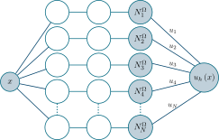{width=400}
:::

::::
:::


## Solving the mechanical problem [@skardovaFiniteElementNeural2025].{.custom-h2-links}

Solving the mechanical problems amounts to finding the continuous displacement field **minimising the potential energy**
$$E_p\left(\vect{u}\right) = \frac{1}{2} \intV \matrice{E} : \ftensor{C} : \matrice{E} \dV - \intSn \vect{F}\cdot \vect{u} \dS - \intV\vect{f}\cdot\vect{u}\dV. $$

::: {style="margin-top: -0.5em;"}
:::


:::: {.columns}

::: {.column width="50%"}

:::{.mybox}

::::{.mybox-header}
In practice
::::

::::{.mybox-body}

* Compute the loss $\mathcal{L} := E_p$ 
* Find the parameters **minimising** the loss
  * Rely on state-of-the-art optimizers (ADAM, **LBFGS**, etc.)

:::

:::

:::

::: {.column width="50%"}

:::{.mybox}

::::{.mybox-header}
Degrees of freedom (Dofs)
::::

::::{.mybox-body}


* Nodal values (standard FEM Dofs)
* Nodal coordinates (Mesh adaptation)
  * hr-adaptivity

::: {style="margin-top: 0.15em;"}
:::

:::

:::

:::

::::

::: {style="margin-top: -1.2em;"}
:::


::: {.fragment .fade-in}

:::: {.columns}

::: {.column width="32%"}

:::: {style='margin-top: 0.5em;'}
::::
{ height="300" loop="true" autoplay=true}
:::

::: {.column width="33%"}

{ height="300" loop="true" autoplay=true}
:::

::: {.column width="24%"}


:::: {style='margin-top: 3em;'}
::::
**h-adaptivity**: red-green refinement

::: {.fragment .fade-up}

**technical details:**

  &nbsp; **Paper** [@skardovaFiniteElementNeural2025]      
  
:::


:::

::::


:::


## Reduced-order modelling (ROM)
**Low-rank** approximation of the solution to avoid the **curse of dimensionality** with $\beta$ parameters

::: columns

::: {.column  width="50%"}
:::{.mybox}

::::{.mybox-header}
Full-order discretised model
::::

::::{.mybox-body}

* $N$ spatial shape functions
  * Span a finite spatial space of dimension $N$
* Requires computing $N\times \beta$ associated parametric functions

::: {style="margin-top: 1.7em;"}
:::
:::

:::
:::
::: {.column  width="50%"}
:::{.mybox}

::::{.mybox-header}
Reduced-order model  
::::

::::{.mybox-body}

* $m \ll N$ spatial modes
  * Similar to global shape functions
  * Span a **smaller space**
* Galerkin projection
:::

:::

:::
:::

:::{.mybox}

::::{.mybox-header-bis}
Finding the reduced-order basis - mostly from previous expensive computations
::::

::::{.mybox-body}

:::: {.columns}

::: {.column width="65%"}
* **Linear Normal Modes** (eigenmodes of the structure) [@hansteenAccuracyModeSuperposition1979]
  * Do not account for the loading and behaviour specifics
* **Proper Orthogonal Decomposition** [@chatterjeeIntroductionProperOrthogonal2000;@radermacherComparisonProjectionbasedModel2013]
  * Require wise selection of the snapshots and \emph{a priori} costly computations 
* **Reduced basis method** [@madayReducedBasisElementMethod2002] with EIM [@barraultEmpiricalInterpolationMethod2004]
  * Rely on prior expensive computations
* **Auto-encoders** for non-linear ROM [@tomasettoLatentFeedbackControl2025]
  * Also relies previously generated data/snapshots
:::

::: {.column width="35%"}

::::: {.fragment .fade-left}

:::: {style='margin-top: 3em;'}
::::

* *A priori* ROM methods relying **only on the PDEs**
  * such as the PGD
:::::

:::

::::

:::

:::


## Proper Generalised Decomposition (PGD) {auto-animate=true} 


* Proper Generalised Decomposition (PGD) : [@ladevezeFamilleDalgorithmesMecanique1985;@chinestaShortReviewModel2011]

::: columns

::: {.column  width="50%"}

:::{.mybox}

::::{.mybox-header}
Tensor Decomposition 
::::

::::{.mybox-body}

* $\textcolor{LGreen}{\textcolor{LGreen}{\para}}$  parameters (material, shape, loading, etc.)
* Curse of dimensionality 

::: {.r-stack}
::: {data-id="1" }
$$
\textcolor{VioletLMS_2}{\vect{u}}\left(\textcolor{Blue}{\vect{x}}, \textcolor{LGreen}{\para}\right)$$
:::
:::


:::

:::

:::

::: {.column  width="50%"}

**Discretised problem**

::: {.r-stack}
::: {data-id="2" }

:::: {style='margin-top: -3em;'}
::::

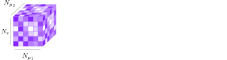{height=250}
:::
:::
::: {.r-stack}
::: {data-id="2" }
* $\textcolor{VioletLMS_2}{N\times\prod\limits_{j=1}^{~\beta} N_{\mu}^j}$ unknowns
  * *e.g.* $\textcolor{VioletLMS_2}{10000 \times 1000^2 = 10^{10}}$
:::
:::
:::

:::


## Proper Generalised Decomposition (PGD) {auto-animate=true visibility="uncounted"} 


* Proper Generalised Decomposition (PGD) : [@ladevezeFamilleDalgorithmesMecanique1985;@chinestaShortReviewModel2011]

::: columns

::: {.column  width="50%"}

:::{.mybox}

::::{.mybox-header}
Tensor Decomposition 
::::

::::{.mybox-body}

* $\textcolor{LGreen}{\textcolor{LGreen}{\para}}$  parameters (material, shape, loading, etc.)
* Curse of dimensionality 

::: {.r-stack}
::: {data-id="1" }
$$            
\textcolor{VioletLMS_2}{\vect{u}}\left(\textcolor{Blue}{\vect{x}}, \textcolor{LGreen}{\para}\right) = \sum\limits_{i=1}^m \textcolor{Blue}{\overline{\vect{u}}_i(\vect{x})} ~\textcolor{LGreen}{\prod_{j=1}^{\beta}\lambda_i^j(\mu^j)}$$ 
:::
:::

* $\textcolor{Blue}{\overline{\vect{u}}_i(\vect{x})}$ space modes
* $\textcolor{LGreen}{\lambda_i^j(\mu^j)}$ parameter modes


:::

:::

:::

::: {.column  width="50%"}

**Discretised problem**

::: {.r-stack}
::: {data-id="2" }

:::: {style='margin-top: -3em;'}
::::

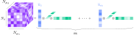{height=250}
:::
:::
::: {.r-stack}
::: {data-id="2" }
* From $\textcolor{VioletLMS_2}{N\times\prod\limits_{j=1}^{~\beta} N_{\mu}^j}$ unknowns to $\textcolor{Blue}{m\times\left(N + \sum\limits_{j=1}^{\beta} N_{\mu}^j\right)}$
  * *e.g.* $\textcolor{VioletLMS_2}{10000 \times 1000^2 = 10^{10}} \gg \textcolor{Blue}{ 5\left( 10 000+ 2\times 1000 \right) = 6 \times 10^4}$
:::
:::
:::

:::


:::: {style='margin-top: -1.2em;'}
::::

::: {.fragment .fade-up}
* Finding the tensor decomposition by **minimising** the **energy**
$$
        \left(\left\{\overline{\vect{u}}_i \right\}_{i\in \llbracket 1,m\rrbracket},\left\{\lambda_i^j \right\}_{
          \begin{cases}
              i\in \llbracket 1,m\rrbracket \\
              j\in \llbracket 1,\beta \rrbracket
          \end{cases}
        } \right) = \argmin_{
            \begin{cases}
                \left(\overline{\vect{u}}_1, \left\{\overline{\vect{u}}_i \right\} \right) & \in \mathcal{U}\times \mathcal{U}_0 \\ 
                \left\{\left\{\lambda_i^j \right\}\right\} & \in \left( \bigtimes_{j=1}^{~\beta} \mathcal{L}_2\left(\mathcal{B}_j\right) \right)^{m-1}
            \end{cases}}  ~\underbrace{\int_{\mathcal{B}}\left[E_p\left(\vect{u}\left(\vect{x},\para\right), \ftensor{C}, \vect{F}, \vect{f} \right)  \right]\mathrm{d}\beta}_{\mathcal{L}}
            \label{eq:min_problem}
$$

:::


## Proper Generalised Decomposition (PGD) {auto-animate=true}
* Building the low-rank tensor decomposition greedily [@ladevezeFamilleDalgorithmesMecanique1985; @nouyPrioriModelReduction2010]

:::: {style='margin-top: -1em;'}
::::

::: {.r-stack}
::: {.fragment fragment-index=2 .fade-out}
::: {data-id="1" }
$$
\vect{u}\left(\vect{x}, \para\right) =  \overline{\vect{u}}(\vect{x}) ~\prod_{j=1}^{\beta}\lambda^j(\mu^j) $$
:::
:::
::: {.fragment fragment-index=2 .fade-in-then-out}
$$
\vect{u}\left(\vect{x}, \para\right) = \textcolor{red}{\sum\limits_{i=1}^{2}} \overline{\vect{u}}_{\textcolor{red}{i}}(\vect{x}) ~\prod_{j=1}^{\beta}\lambda_{\textcolor{red}{i}}^j(\mu^j) $$
:::
::: {.fragment fragment-index=3 .fade-in}
::: {data-id="2" }
$$
\vect{u}\left(\vect{x}, \para\right) = \sum\limits_{i=1}^{\textcolor{red}{m}} \overline{\vect{u}}_i(\vect{x}) ~\prod_{j=1}^{\beta}\lambda_i^j(\mu^j) $$
:::
:::
:::
<style>
.add-space{
padding-right: 10%;
}
</style>

:::: {style='margin-top: -1em;'}
::::

::: columns

::: {.column  width="40%" .add-space}

**Greedy algorithm**

::: {.fragment fragment-index=1 .fade-in}
1. Start with a single mode
2. Minimise the loss until stagnation
:::
::: {.fragment fragment-index=2 .fade-in}
3. Add a new mode 
4. If loss decreases, continue training
:::
::: {.fragment fragment-index=3 .fade-in}
5. Else stop and return the converged model
:::

:::

::: {.column  width="50%" }

::: {.fragment fragment-index=4 .fade-in}

:::{.mybox}

::::{.mybox-header}
The PGD is
::::

::::{.mybox-body}

* An *a priori* ROM techniques
  * Building the model **from scratch** on the fly
* No full-order computations
* Reduced-order basis tailored to the specifics of the problem [@daby-seesaramHybridFrequencytemporalReducedorder2023]

:::

:::

:::

:::

:::

::: {.fragment fragment-index=5 .fade-in}

:::{.mybox}

::::{.mybox-header}
Note
::::

::::{.mybox-body}

* Training of the full tensor decomposition, not only the $m$-th mode
* Actual **minimisation** implementation of the PGD
* No need to solve a new problem for any new parameter 
  * The online stage is a **simple evaluation** of the tensor decomposition

:::

:::

:::


## Neural Network PGD {auto-animate=true}
Graphical implementation of Neural Network PGD

::: {.r-stack}
::: {data-id="2" }
$$            \vect{u}\left(\textcolor{Blue}{\vect{x}}, \textcolor{LGreen}{\para}\right) = \sum\limits_{i=1}^m \textcolor{Blue}{\overline{\vect{u}}_i(\vect{x})} ~\textcolor{LGreen}{\prod_{j=1}^{\beta}\lambda_i^j(\mu^j)} $$
:::
:::

::: columns

::: {.column  width="65%"}

:::{.mybox}

::::{.mybox-header}
Interpretable NN-PGD
::::

::::{.mybox-body}

* No black box
  * Fully interpretable implementation
  * Great transfer learning capabilities
* Straightforward implementation
  * Benefiting from current ML developments
:::

:::

::: {.fragment fragment-index=1 .fade-in}

* Straightforward definition of the physical loss using auto-differentiation
```{python}
#| echo: true
#| code-fold: false
#| code-summary: ""
def Loss(model,x,detJ,mu):
  
    u = model.space_mode(x)
    eps = torch.autograd.grad(u, x, grad_outputs=torch.ones_like(u))
    lmbda = model.parameter_mode(mu)
    W_int = torch.einsum('ij,ejm,eil,em,mp...,lp...,p->',C,eps,eps,detJ,lmbda,lmbda, mu)

    return 0.5*W_int/mu.shape[0]

```

:::

:::

::: {.column  width="35%"}

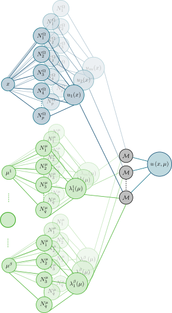{height=400}

:::
:::


## Stiffness and external forces parametrisation

Illustration of the surrogate model in use [@daby-seesaramFiniteElementNeural2025]

::: columns

::: {.column  width="50%"}


:::: {style='margin-top: -1em;'}
::::

:::: {.mybox}

::: {.mybox-header}
Parameters
:::

::: {.mybox-body}
* Parametrised stiffness $E$
* Parametrised external force $\vect{f} =  \begin{bmatrix}
           ~ \rho g \sin\left( \theta \right) \\
           -\rho g \cos\left( \theta \right) \cos\left( \phi \right) \\
           \rho g \cos\left( \theta \right) \sin\left( \phi \right) 
         \end{bmatrix}$
:::

::::


:::

::: {.column  width="50%"}

:::: {style='margin-top: 1em;'}
::::

{.absolute left="5" height="394" loop="true" autoplay=true}

:::: {style='margin-top: -2em;'}
::::

:::: {.mybox}

::: {.mybox-header}
NN-PGD
:::

::: {.mybox-body}

:::: {style='margin-top: 1em;'}
::::

* Immediate evaluation of the surrogate model (~100Hz)
* Straightforward differentiation capabilities regarding the input parameters

:::: {style='margin-top: 0.25em;'}
::::

::: {style="margin-top: 1.25em;"}
:::
:::

::::

:::

:::


## Convergence of the greedy algorithm 

:::: {.columns}

::: {.column width="50%"}



:::

::: {.column width="50%"}



:::

::::

:::: {.mybox}

::: {.mybox-header}

Construction of the ROB

:::

::: {.mybox-body}

* New modes are added when the loss's decay cancels out
* Adding a new mode gives extra latitude to improve predictivity

:::

::::


## Accuracy with regards to FEM solutions

:::: {.columns}

::: {.column width="65%"}

<!-- | Solution      | Error         |
|---------------|---------------|
| {width="100%"} | {width="100%"} |
| {width="100%"} | {width="100%"} | -->

| Solution                                                                                     | Error                                                                                     |
|---------------------------------------------------------------------------------------------|------------------------------------------------------------------------------------------|
| 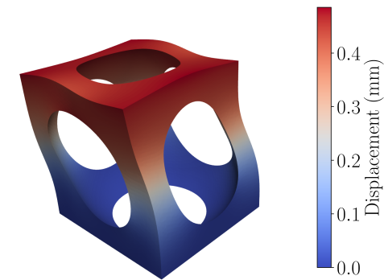{width="100%"} <br> $E = 3.8 \times 10^{-3}\mathrm{ MPa},  \theta = 241^\circ$  | 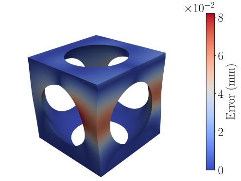{width="100%"} <br> $E = 3.8 \times 10^{-3}\mathrm{ MPa},  \theta = 241^\circ$ |
| 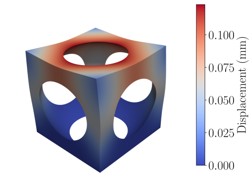{width="100%"} <br> $E = 3.1 \times 10^{-3}\mathrm{ MPa},  \theta = 0^\circ$ | 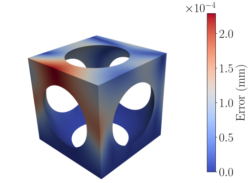{width="100%"} <br> $E = 3.1 \times 10^{-3}\mathrm{ MPa},  \theta = 0^\circ$ |


:::

::: {.column width="35%"}

:::: {style='margin-top: 8em;'}
::::

::: {.cell}

| $E$ (kPa) | $\theta$ (rad) | Relative error     |
|-----------|----------------|--------------------|
| 3.80      | 1.57           | $1.12 \times 10^{-3}$ |
| 3.80      | 4.21           | $8.72 \times 10^{-4}$ |
| 3.14      | 0              | $1.50 \times 10^{-3}$ |
| 4.09      | 3.70           | $8.61 \times 10^{-3}$ |
| 4.09      | 3.13           | $9.32 \times 10^{-3}$ |
| 4.62      | 0.82           | $2.72 \times 10^{-3}$ |
| 5.01      | 2.26           | $5.35 \times 10^{-3}$ |
| 6.75      | 5.45           | $1.23 \times 10^{-3}$ |

:::

:::

::::


## Multi-level training


:::: {.columns}

::: {.column width="65%"}
{width=500}
:::

::: {.column width="35%"}

::: {style="margin-top: 4em;"}
:::

:::: {.mybox}

::: {.mybox-header}
Strategy
:::

::: {.mybox-body}
* The **interpretability** of the NN allows
  * Great **transfer learning** capabilities
    * Start with **coarse** (cheap) training
    * Followed by **fine tuning**, refining all modes
* Extends the idea put forward by [@giacomaOptimalPrioriReduced2015]
:::

::::

:::

::::

:::: {.mybox}

::: {.mybox-header-bis}
Note
:::

::: {.mybox-body}
* The structure of the **Tensor decomposition** is kept throughout the multi-level training
* Last mode of each level is irrelevant by construction
  * It is removed before passing onto the next refinement level

:::

::::


# II - Patient-specific parametrisation {.part-slide}

:::: {.columns}

::: {.column width="50%"}

:::: {style='margin-top: 10em;'}
::::

+--------------------------------------+
|  1. **Shape registration pipeline from CT-scans**                        
+--------------------------------------+
|  2. **Building a geometry model from the shapes library**                    |
+--------------------------------------+

:::: {style='margin-top: 1em;'}
::::

{ width="15%" fig-align="left"}

:::

::: {.column width="50%"}

:::: {style='margin-top: 4em;'}
::::
{ height="300" loop="true" autoplay=true fig-align="center"}

:::

::::

## Parametrisation of high-dimensional quantities

* Most relevant patient specific quantities *a priori* lives in high dimension and are not parametrised
  * A parametrisation step is required to use a relatively small number of patient-specific parameters

:::: {.columns}

::: {.column width="50%"}

**Fibrosed-healthy clustering**


![Fibrosed zones [@peyrautQuantificationDincertitudesPour2024a]](Figures/fibrosed.png){ width="85%" fig-align="left"}

:::

::: {.column width="50%"}

**Shapes**

:::: {.columns}

::: {.column width="49%"}

{ width="80%" }

:::

::: {.column width="49%"}
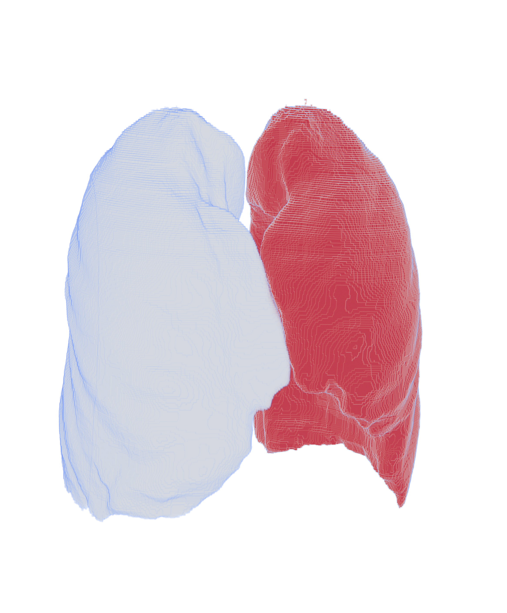{ width="80%" }

:::

::::

:::: {style='margin-top: -3em;'}
::::

:::: {.columns}

::: {.column width="49%"}

{ width="80%" }

:::

::: {.column width="49%"}
{ width="80%" }

:::

::::

:::

::::


## Shape model - registration [@ganglFullySemiautomatedShape2021].{.custom-h2-links} 


:::: {.columns}

::: {.column width="50%"}


:::: {.mybox}

::: {.mybox-header}
Computing the mappings
:::

::: {.mybox-body}

* The objective is to find the domain $\omega$ occupied by a given segmented shape in a 3D image
* Which is solution of 

$$\omega = \arg \min\underbrace{ \int_{\omega} I\left( x \right) \mathrm{d}\omega}_{\Psi\left(\omega\right)}$$ 

**With requirement** that $I\left( x \right) \begin{cases} < 0 \forall x \in \mathcal{S} \\ > 0 \forall x \not \in \mathcal{S} \end{cases}$, with $\mathcal{S}$ the image footprint of the shape to be registered

:::

::::

The domain $\omega$ can be described by mapping $$\Phi\left(X\right) = I_d + u\left(X\right)$$ from a reference shape $\Omega$, leading to
$$\int_{\omega} I\left( x \right) \mathrm{d}\omega = \int_{\Omega} I \circ \Phi \left( X \right) J \mathrm{d}\Omega$$


:::

::: {.column width="50%"}

:::: {style='margin-top: 1.5em;'}
::::

#### Shape derivatives

* $D\Psi\left(\omega\right)\left(\vect{u}^*\right) = \int_{\Omega} \nabla I \cdot u^* J \mathrm{d}\Omega + \underbrace{\int_{\Omega}I \circ \Phi\left(X\right) (F^T)^{-1} : \nabla u^* J \mathrm{d}\Omega}_{\int_{\omega}I\left(x\right) \mathrm{div}\left( u^* \circ \Phi \right) \mathrm{d}\omega}$

#### [Sobolev gradient](https://citeseerx.ist.psu.edu/document?repid=rep1&type=pdf&doi=8642717af96b1980458efda55830b826a17eb2bd) [@neubergerSteepestDescentDifferential1985; @neubergerSobolevGradientsDifferential1997]

$$D\Psi\left(u\right)\left(v^*\right) = \left(\nabla^H \Psi \left(u\right), v^* \right)_H$$

* Classically:
  * $\left(\vect{u}, \vect{v}^* \right)_H := \int_{\omega} \matrice{\nabla_s}\vect{u}:\matrice{\nabla_s}\vect{\vect{v}^*}\mathrm{d}\omega + \alpha \int_{\omega} \vect{u} \cdot \vect{v^*}\mathrm{d}\omega$

:::: {style='margin-top: 2em;'}
::::

<div style="border-top: 1px solid #00436d; width: 45%; margin: 0 auto;"></div>

:::: {style='margin-left: 14%;'}

{ height="300" loop="true" autoplay=true fig-align="center"}
::::


:::

::::


## Shape model - parametrisation

:::: {style='margin-top: -0.5em;'}
::::

:::: {.mybox}

::: {.mybox-header}
Encoding the shape of the lung in a low-dimensional space
:::

::: {.mybox-body}
* In order to feed the surrogate model we need a parametrisation of the lung
* ROM on the shape mappings library
:::

::::

:::: {style='margin-top: -1em;'}
::::

:::: {.columns}

::: {.column width="50%"}

::: {.r-stack}


:::::: {.fragment fragment-index=1 .fade-out}


<iframe width="100%" height="400" src="https://alexandredabyseesaram.github.io/Resources/AR/3D_lung_AR.html"></IFRAME>


::::::

:::::: {.fragment fragment-index=1 .fade-in}


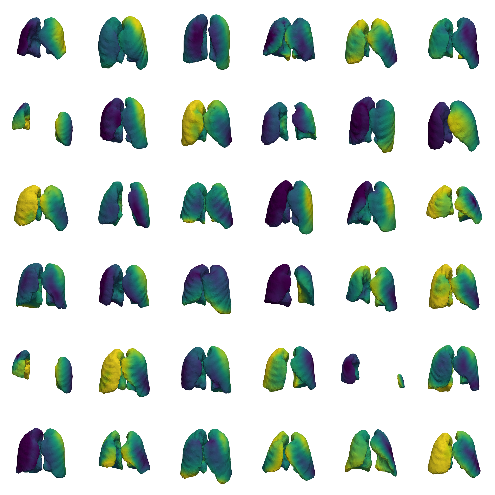{ height="400" fig-align="center" .lightbox}


::::::

:::


:::

::: {.column width="50%"}

:::::: {.fragment fragment-index=2 .fade-in-then-out}




::::::

:::::: {.fragment fragment-index=3 .fade-in}

:::: {style='margin-top: -18em;'}
::::

:::: {.mybox}

::: {.mybox-header-bis}
Shape model
:::

::: {.mybox-body}

* Shape analysis
* Model-order reduction on shapes
  * Parametrisation of the shape
  * $\Omega = \Omega\left(\textcolor{LGreenLMS}{\para}\right)$
    * SVD
    * k-PCA
    * Auto-encoder
  * Personalising the digital twin


:::

::::

::::::

:::

::::


## Shape model - from an average shape

:::: {.columns}

::: {.column width="55%"} 

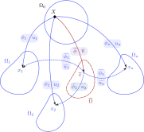{ width=85% fig-align="center"}

:::: {style='margin-top: -2.5em;'}
::::

* $\forall i \in \llbracket1,n\rrbracket$
  * $\vect{u}_i, \phi_i\left(\vect{X}\right)$ mappings and transformations on the sphere
  * $\overline{\vect{u}}_i, \overline{\phi}_i\left(\overline{\vect{x}}\right)$ mappings and transformations on the average shape
* $\overline{\Omega}$ The average shape
  * $\overline{\vect{u}}, \overline{\phi}\left(\overline{\vect{x}}\right)$ mappings and transformations from sphere to AS


:::

::: {.column width="44%"}

* Kinematics on the average shape $\overline{\Omega}$

::: {data-id="2" }

$$
\begin{align}
\underbrace{\matrice{1} + \matrice{\nabla}_{\overline{\vect{x}}} \overline{\vect{u}}_i\left(\overline{\vect{x}}\right)}_{\matrice{\overline{F}}_i} & = \matrice{1} + \matrice{\nabla}_X \left( \vect{u}_i\left(\vect{X}\right) - \overline{\vect{u}}\left(\vect{X}\right) \right) \matrice{\overline{F}}^{-1} \\
& = \matrice{F}_i \matrice{\overline{F}}^{-1} \\
\end{align}$$

:::

* From there we can compute $$\overline{\Omega} = \text{argmin} \sum\limits_{i=1}^n \int_{\overline{\Omega}} W\left( \matrice{\overline{F}}_i\right)$$ 
* And then we parametrise the residual mappings 
$$\overline{u}_i = \overline{u}_i\left(\para \right) := u_i - \overline{u}$$


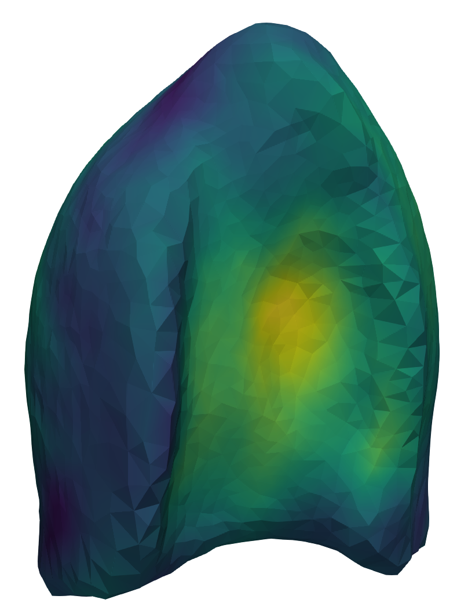{ width=35% fig-align="center"}

:::

::::


## Preliminary results on varying porosity

Varying porosity value changing the geometry of the local RVE.


:::: {.columns}

::: {.column width="33%"}

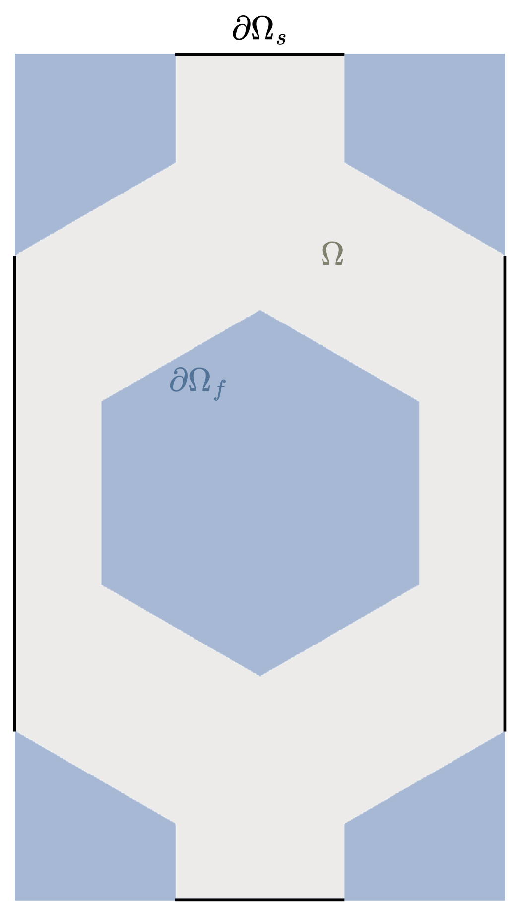{ width=45% fig-align="center"}

:::

::: {.column width="32%"}

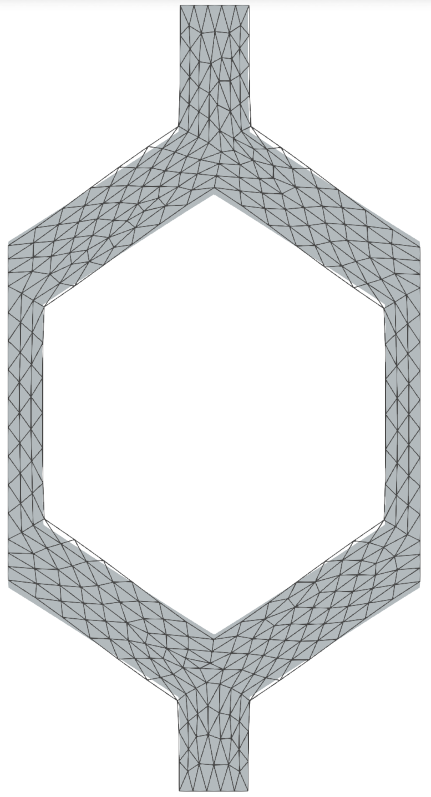{ width=25% fig-align="center"}

:::

::: {.column width="32%"}
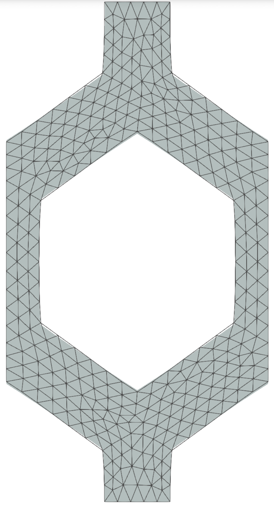{ width=25% fig-align="center"}

:::

::::

:::: {.columns}

::: {.column width="33%"}
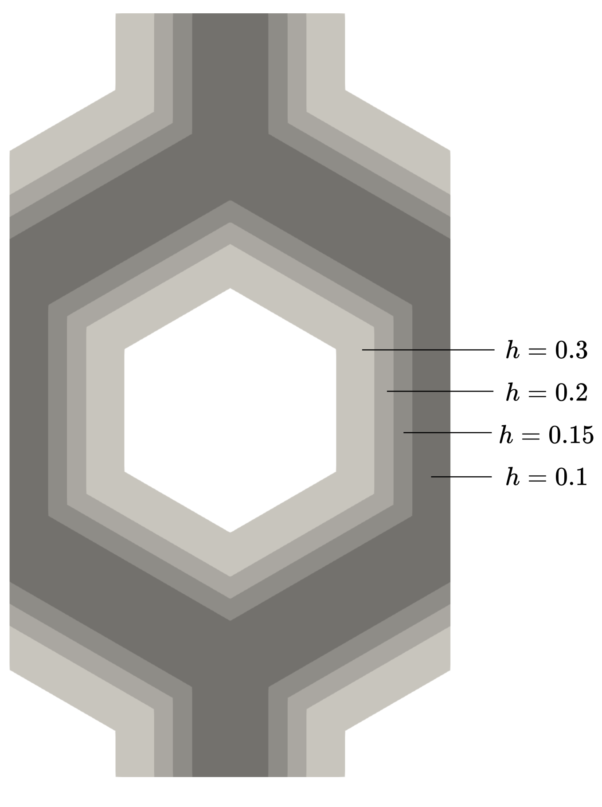{ width=45% fig-align="center"}

:::

::: {.column width="32%"}
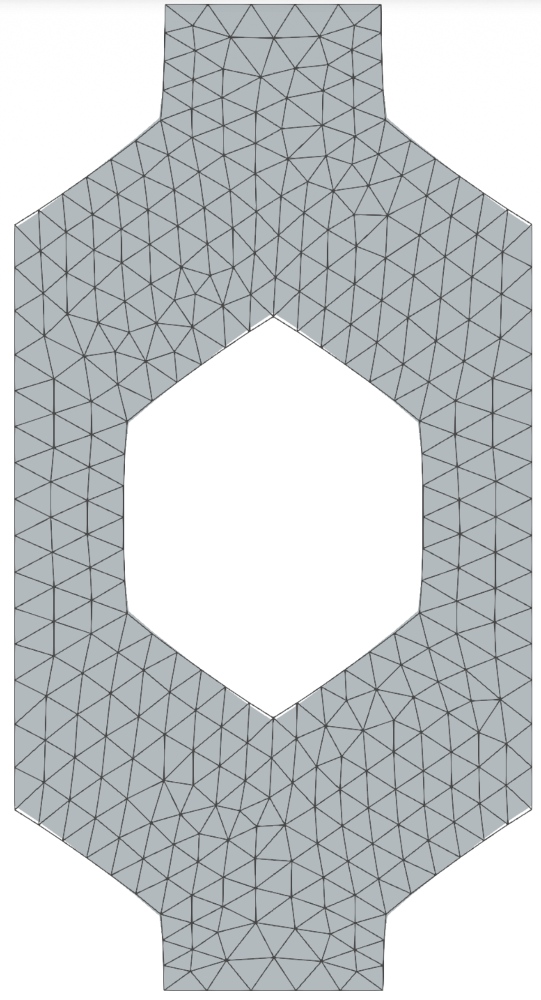{ width=25% fig-align="center"}

:::

::: {.column width="32%"}
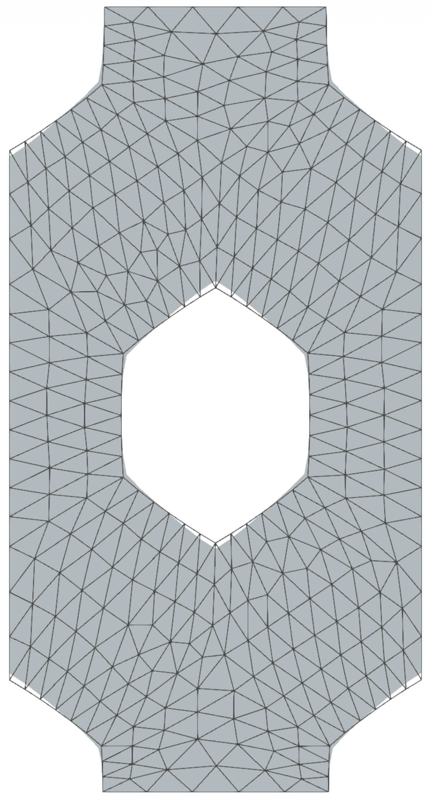{ width=25% fig-align="center"}

:::

::::

## Conclusion


:::: {.columns}

::: {.column width="50%"}

:::: {.mybox}

::: {.mybox-header}
Conclusion
:::

::: {.mybox-body}

* Robust and straightforward general implementation of a NN-PGD
  * Interpretable
  * Benefits from all recent developments in machine learning
* Surrogate modelling of parametrised PDE solution
  * Promising results on simple toy case
  * Shape variability taken into account

:::: {style='margin-top: 1.7em;'}
::::

:::

::::

:::

::: {.column width="45%"}

:::: {.mybox}

::: {.mybox-header}
Perspectives for patient-specific applications
:::

::: {.mybox-body}

* Personalised shape-informed digital-twins

:::: {.columns}

::: {.column width="50%"}

{.absolute height=130 loop="true" autoplay=true}

:::

::: {.column width="4%"}

:::: {style='margin-top: 3em;'}
::::

### +

:::: {style='margin-top: 4em;'}
::::

:::

::: {.column width="45%"}

{.absolute height=130 loop="true" autoplay=true}


:::

::::

:::

::::
:::

::::


:::: {.columns}

::: {.column width="50%"}

:::: {.mybox}

::: {.mybox-header}
Prospective applications
:::

::: {.mybox-body}
* Digital twin for 
  * real-time patient-specific simulations
    * Diagnostics and prognostics
    * Control of medical devices (forced ventilation, etc)
  * shape-optimisation (of 3D printed organs, personalised prosthesis, etc.)
    * Inexpensive shape derivative of mechanical quantities
:::
 
::::

:::

::: {.column width="50%"}

 &nbsp; **Papers**: [@skardovaFiniteElementNeural2025;@daby-seesaramFiniteElementNeural2025]

:::: {style='margin-top: -1em;'}
::::

:::: {.columns}

::: {.column width="49%"}

{ width=100%}
[](
https://pypi.org/project/NeuROM-Py/)

:::

::: {.column width="49%"}

:::: {style='margin-top: 1em;'}
::::

||
|:--:| 
|[Github page](https://alexandredabyseesaram.github.io/)|

:::

::::


:::

::::


## References


